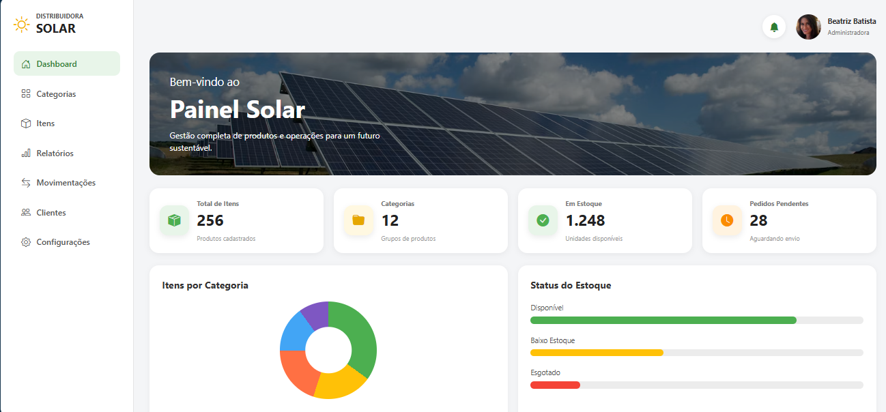
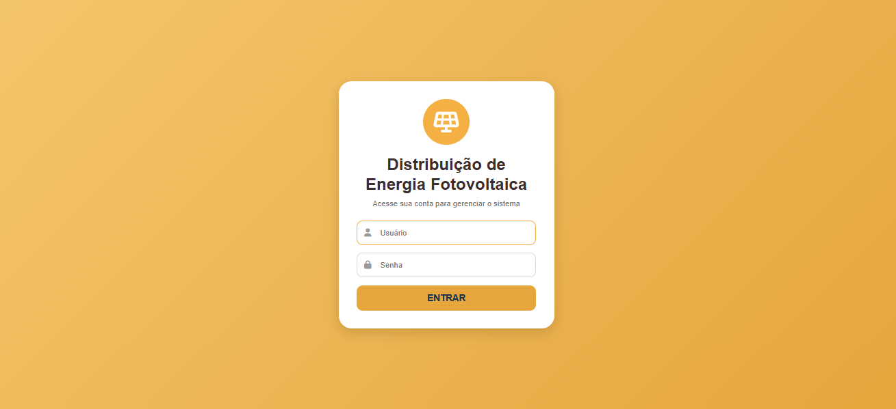
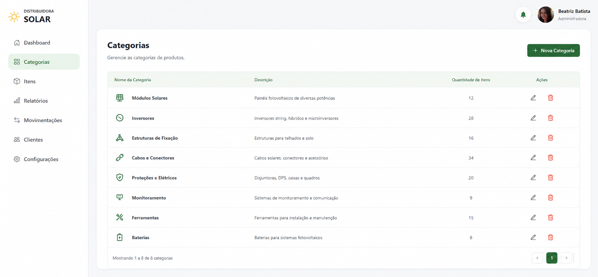
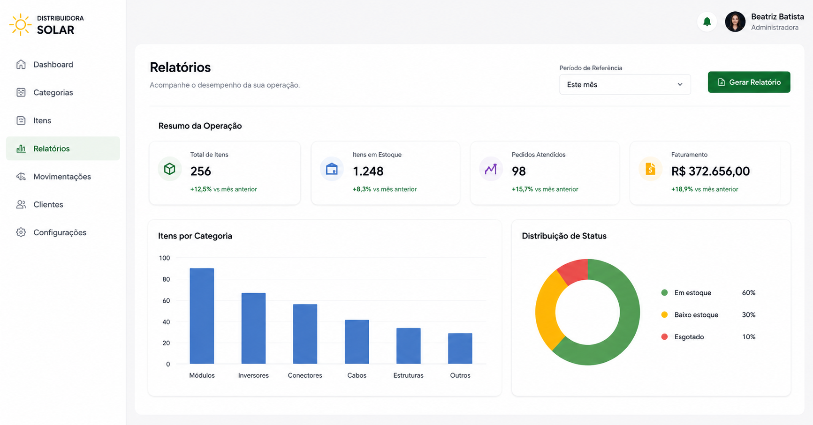
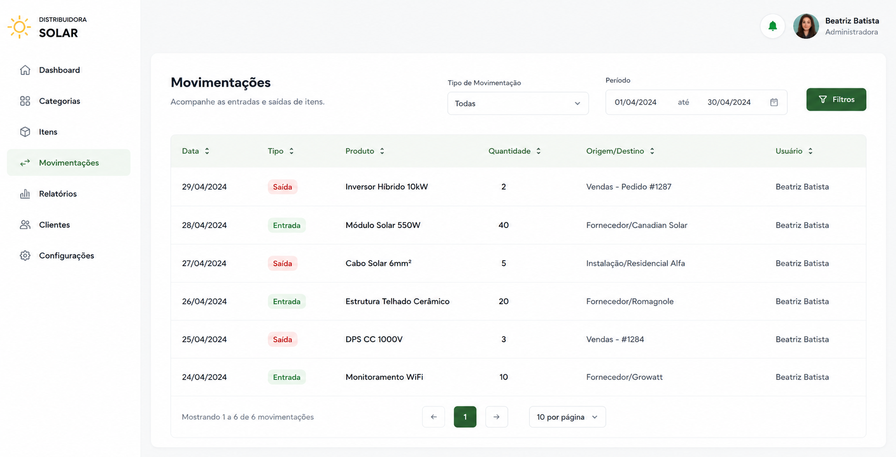
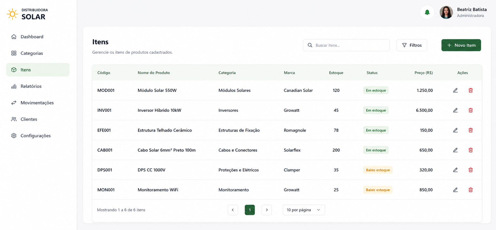
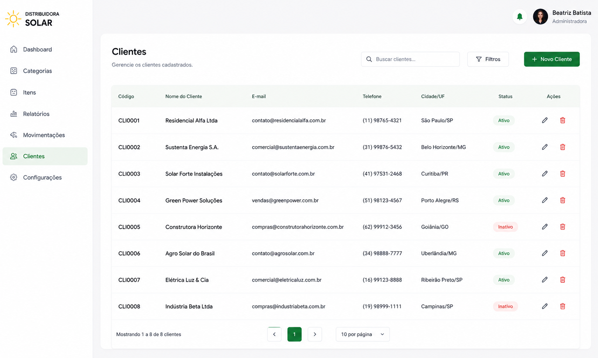
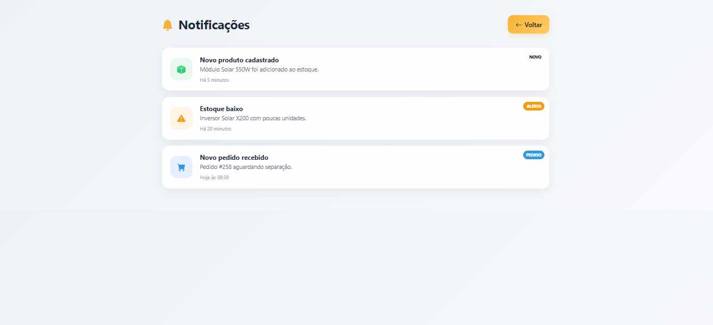
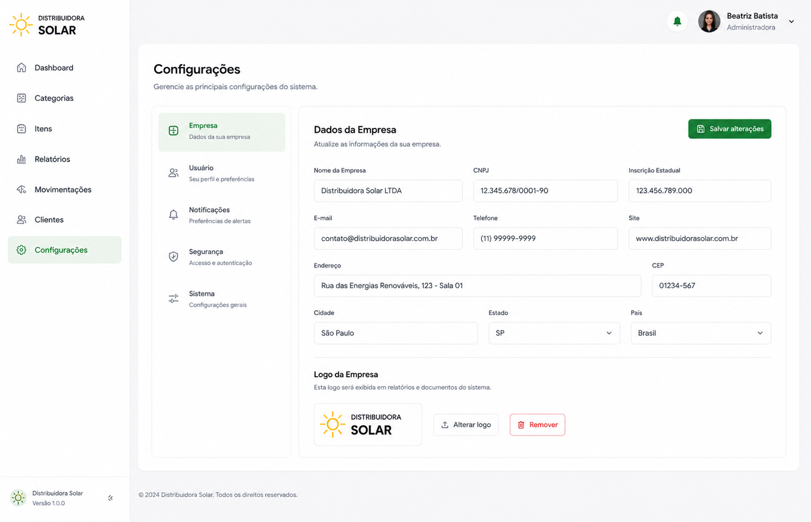

  

<h3 align="center">
  Atividade de 2026 da matéria do curso de Programação de Aplicativos Mobiles.
</h3>
  

  
# Telas do Projeto - Inventário

  

| Tela Inicial | Tela de Login | Tela de Categorias |
|------------------|--------------------------|-------------------------|
|  |  |  |
 

| Tela de Relatórios | Tela de Movimentações | Tela de Itens |
|------------------|--------------------------|-------------------------|
|  |  |  |

| Tela Clientes | Tela de Notificação | Tela de Configurações |
|------------------|--------------------------|-------------------------|
|  |  |  |

